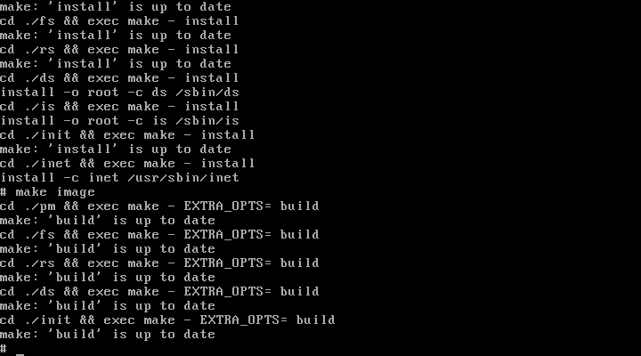
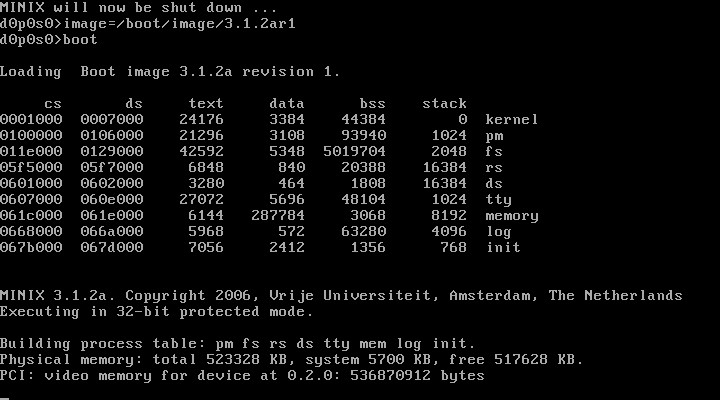

*Alunos: Leonardo Daneu Lopes (8516816) e Lucas Sung Jun Hong (8124329)*

### MAC0422 - Sistemas Operacionais
## Relatório
# i_nodes

<div style="page-break-after: always;"></div>

# Conteúdo


* 0.0) Introdução
* 1.0) Locais de modificação
	* 1.1) Tratamento de arquivos imediatos
	* 1.2) *do_lsr*
	* 1.3) Inserindo *lsr* na biblioteca
* 2.0) Problemas
* 3.0) Entrega incompleta

<div style="page-break-after: always;"></div>

# 0.0) Introdução

**Máquina usada**: `Windows 10`

**VM usada**: `Oracle VM VirtualBox Manager`

# 1.0) Locais de modificação
Para o funcionamento deste EP, foram feitas várias modificações:

### 1.1) Tratamento de arquivos imediatos
Em,

    /usr/src/include/minix/const.h
    /usr/include/minix/const.h

Escolhendo bits não utilizados, temos a definição: `#define I_IMEDIATO   0110000 /* immediate file */`

Em `alloc_inode`, no arquivo `/usr/src/servers/fs/inode.c`, em linhas como

    rip->i_mode = bits;   // set up RWX bits

Fazemos tratamento de arquivos imediatos da sequinte maneira:

    rip->i_mode = (bits & I_REGULAR ? bits | I_IMEDIATO : bits);

### 1.2) *do_lsr*

Em,

		cd /usr/src/servers/fs/inode.c

Criamos:

```cpp
	/* ========================================================================= */
	/*                              do_lsr                                       */
	/* ========================================================================= */

	PUBLIC int do_lsr() {

		int          i, d, r;
		struct inode *ip;
		struct inode *node;
		struct filp  *f;
		struct fproc *fp;
		message      m;

		r = fetch_name( m_in.name, m_in.name_length, M3 );

		if ( (ip = eat_path(user_path)) == NIL_INODE) {
			printf ("Arquivo nao existe! \n");
			return (-1);
		}

		/* Se arquivo existir*/
		else {
			node = get_inode( ip->i_dev, (ino_t)ip->i_num );
			if (node != NULL) {

				printf("Lista dos PIDs: \n");

				for ( f = &filp[0]; f < &filp[NR_FILPS]; f++ )  {
					if( f->filp_ino == ip ) {
						for ( r = 0; r < NR_PROCS; r++ ) {
							for ( i = 0; i < OPEN_MAX; i++ ) {       
								if( fproc[r].fp_filp[i]->filp_ino == f->filp_ino ) {
									printf("PID: %d \n", fproc[r].fp_pid);
									break;
								}
							}
						}
						break;
					}   
				}

				printf("Lista de numeros dos blocos \n");  

				d = node->i_size / 4096 ;
				r = node->i_size % 4096 ;

				if( r > 0 ) d = d + 1;

				for(i = 0; i < d; i++)
					printf("Bloco: %d \n", read_map( node, i*4096 ));

			}

			else printf ("Arquivo vazio!")

			m.m_source     = ip->v_dev;
			m.m_type       = 0;

			return OK;
		}
	}

```

### 1.3) Inserindo *lsr* na biblioteca

		Em: /usr/src/lib/posix/_access.c

			PUBLIC int lsr(char *path)
			{
				message m;
				_loadname( path, &m );
				return  _syscall( FS, 70, &m );   
			}

		Em: /usr/src/include/unistd.h

			_PROTOTYPE( int lsr, (char *path) );

		Sendo que definimos o nosso lsr em:

			/usr/src/include/minix/callnr.h
			/usr/include/minix/callnr.h

			#define LSR     70


<div style="page-break-after: always;"></div>

<!-- sdasd_ -->

# 2.0) Problemas

Executamos com sucesso o seguinte, em `/usr/src/servers`:

		make install
		make image



No entanto, após feito o boot:

		cd /usr/src/tools
		make hdboot
		make install
		shutdown
		image=/boot/image/3.1.2ar1
		boot

Temos a tela de "Loading", que infelizmente não termina...



<div style="page-break-after: always;"></div>

# 3.0) Entrega incompleta

Devido à esse problema em que o Minix não termina o seu Loading, entregamos uma versão em que os seguintes comandos não foram executados:

		cd /usr/src/tools
		make hdboot
		make install
		shutdown
		image=/boot/image/3.1.2ar1
		boot

Logo, executar o comando `lsr()` produz o resultado:


Repetindo, caso os comandos de `make hdboot`, etc forem executados, teremos **êxito**, no entanto ao dar o `reboot`, obtemos a tela congelada.

<div style="page-break-after: always;"></div>

# 8) Bibliografia

* http://stackoverflow.com/
* http://man7.org/linux/man-pages/man2/
* http://www.tutorialspoint.com/cprogramming/
* http://paca.ime.usp.br/
* http://pubs.opengroup.org/onlinepubs/7908799/xsh/unistd.h.html
* http://www.die.net/
* http://users.sosdg.org/~qiyong/mxr/blurb.html
* https://github.com/minix3/minix
* https://coop10.wordpress.com/2009/05/13/como-adicionar-system-call-no-minix/
* https://minixnitc.github.io/report.pdf
* https://www.cs.ucsb.edu/~bboe/public/slides/cs170-2011-05-17_proj3.pdf
* http://www.cis.syr.edu/~wedu/seed/Labs/Documentation/Minix3/How_to_add_system_call.pdf
* http://www.cise.ufl.edu/~cop4600/cgi-bin/lxr/http/source.cgi/fs/inode.c
