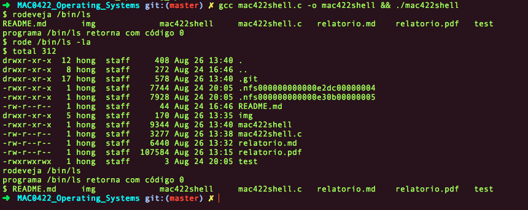

*Alunos: Leonardo Daneu Lopes (8516816) e Lucas Sung Jun Hong (8124329)*

### MAC0422 - Sistemas Operacionais
## Relatório
# mac422shell

<div style="page-break-after: always;"></div>

# Conteúdo

1) Introdução

2) Proteção 000 e 777

 2.1) protegepracaramba ()

 2.2) liberageral ()

3) Função: rodeveja ()

4) Função: rode ()

5) Função auxiliar

6) Exemplo de execução

7) Bibliografia

<div style="page-break-after: always;"></div>

# 1) Introdução
Para o funcionamento deste EP, temos as seguintes funções:

```cpp
int protegepracaramba   ( char *filename );
int liberageral         ( char *filename );
int rodeveja            ( char **comando );
void rode               ( char **comando );
void separa_token       (char *comando, char *parametro[]);

```

# 2) Proteção 000 e 777

## 2.1) protegepracaramba ()

Para a proteção 000, fazemos uma chamada: `return chmod (filename, 0)`.

Um exemplo de execução, usando um arquivo `test`, em que inicialmente tem o estado: `-rwxr-xr-x`, após a execução do `protegepracaramba test`, teremos o estado `----------`:

```cpp
-rwxr-xr-x 1 lucassjhong bcc 6744 Ago 25 19:00 test
$ protegepracaramba test
---------- 1 lucassjhong bcc 6744 Aug 25 19:04 test
```

## 2.2) liberageral ()

Para a proteção 777, fazemos uma chamada: `return chmod (filename, 0777)`.

Um exemplo de execução, usando um arquivo `test`, em que inicialmente tem o mesmo estado anterior: `-rwxr-xr-x`, após a execução do `liberageral test`, teremos o estado `-rwxrwxrwx`:

```cpp
-rwxr-xr-x 1 lucassjhong bcc 6744 Ago 25 19:23 test
$ liberageral test
-rwxrwxrwx 1 lucassjhong bcc 6744 Ago 25 19:26 test
```

<div style="page-break-after: always;"></div>

# 3) Função: rodeveja ()

Após a declaração de um processo `pid_t pid = fork();`, verifica-se:

```cpp
    // processo filho
    if (pid == 0) execve(comando[0], comando, newenviron);
    
    // erro no fork()
    else if (pid == -1) {
        perror("Erro");
        exit(0);
    }
    // processo pai
    else {
        if (wait(&status) != -1) {
            if (WIFEXITED(status)) printf("programa %s retorna com código %d\n", comando[0], WEXITSTATUS(status));
            else if (WIFSIGNALED(status)) printf("pid %ld não detectou número do signal %d\n", (long)pid, WTERMSIG(status));
        }
    }
```

Se o processo é igual a zero, temos um processo **filho** e executaremos o processo através do `execve()`, em que passamos no primeiro argumento o comando, em seguida os argumentos do comando, sendo ele um array de strings e por último environment, nesse caso, `{ NULL }`;

Se o processo é -1, trataremos a entrada como um erro;

Caso contrário, teremos um processo **pai** e faremos a verificação: 

*i)* `if (WIFEXITED(status))`: se o processo filho retorna um valor maior que zero, imprimimos esse resultado, sendo que foi executado sem problemas;

*ii)* `else if (WIFSIGNALED(status))`: caso contrário, foi recebido um sinal do sistema e imprimimos uma mensagem de erro.

<div style="page-break-after: always;"></div>

# 4) Função: rode ()

Muito similar com a função `rodeveja()`:

```cpp
void rode ( char **comando) {
    char *const newenviron[] = { NULL };
    pid_t pid = fork();

    // processo filho
    if (pid == 0 ) execve(comando[0], comando, newenviron);

    // erro no fork()
    else if (pid == -1) {
        perror("Erro");
        exit(0);
    }
}

```

Fazemos apenas duas verificações: um erro ou se o processo é filho. O processo pai não é executado.

<div style="page-break-after: always;"></div>

# 5) Função auxiliar

Usamos uma função auxiliar: `void separa_token (char *comando, char *parametro[])`, em que o primeiro parâmetro é um ponteiro para `char` e o segundo é um array de strings.

```cpp
    int i;
    char *tmp;
    tmp = strtok(comando, DELIM);
    printf("tmp = %s\n", tmp);
    for(i = 0; tmp != NULL; i++) {
        parametro[i] = tmp;
        tmp = strtok (NULL, DELIM);
        printf("parametro = %s\n", parametro[i]);
    }
    parametro[i] = NULL;
```

Essa função recebe algo como `/bin/ls -la`. Ele fará a separação usando `" "`. Um array de strings, aqui chamado de `*parametro[BUFF_SIZE]` terá em cada posição um token. Por exemplo, na primeira posição, teremos `/bin/ls`, na segunda, `-la` e na última posição, `NULL`.

Note: Defininimos o tamanho do `*parametro[BUFFSIZE]`. Aqui, `BUFFSIZE` = 50 pois assume-se que os argumentos de entrada, por exemplo `<caminho do arquivo>` ou `<caminho do programa>`, não passará de mais de 50 caracteres). Assim, o primeiro token aponta para `/bin/ls`.    

Assim, essa função retorna um array de strings tal que cada posicão possui os argumentos corretos para a execução.

<div style="page-break-after: always;"></div>

# 6) Exemplo de execução

## 6.1) rodeveja()

No `void main(void)`, recebemos uma linha de execução como `rodeveja /bin/ls -la`. Executa-se a linha `tmp = strtok (line_tudo, DELIM);`, em que separamos essa linha usando `tokens`. O `DELIM` é um delimitador que faz a separação por `" "`. Assim o token, no caso um ponteiro, aponta para `rodeveja` inicialmente. Fazemos uma comparação de strings para verificar qual a função chamada. 

Feita a verificação, faremos que o token aponte para o seguinte string: `/bin/ls -la` através de `tmp = strtok (line_tudo, DELIM_SPACE);`. Note que aqui o delimitador fará a delimitação por `"\n\0"`, ou seja, ele cortará até o nosso `ENTER` pois não queremos perder `-la`. Assim, chamamos a função `separa_token()`, que retorna um array de strings com cada posição contendo um argumento para execução.

Assim, usando esse array de strings como parâmetro, chamamos a função `rodeveja()`.


## 6.2) rode()

Temos peculiaridades na função `rode()`. O `mac422shell` foi testado em dois sistemas operacionais: `Mac OSX` e `Minix`.

### Mac OSX

No `Mac OSX`, a função funciona perfeitamente:

* ocorre a monopolização do teclado;
* mostra a saída do shell e do programa;
* não retorna o código de saída do programa.



No screenshot, foi feita a compilação e a execução `gcc mac422shell.c -o mac422shell && ./mac422shell`.

Em ordem, entramos com as instruções:

1. `$  rodeveja /bin/ls`: realizamos uma instrução básica para ter certeza que o programa está rodando;
2. `$ rode /bin/ls -la`: executamos `rode`. Ela retorna a saída e monopoliza o teclado;
3. `rodeveja /bin/ls`: por último, voltamos com uma função básica para certificar que o programa continua funcionando;
4. `Control + D`: para sair do programa.

**Note que utilizamos o `$` como indicador da espera de uma instrução no shell.**

### Minix

Já no `Minix`, `$` não desaparece quando a mesma sequência de instruções é executada:


Como solução, executamos a linha `printf ("\33[2K\r")`, que funciona como uma *backspace*, que apaga o `$`. 

<div style="page-break-after: always;"></div>

# 7) Bibliografia

* http://stackoverflow.com/
* http://man7.org/linux/man-pages/man2/
* http://www.tutorialspoint.com/cprogramming/
* http://paca.ime.usp.br/
* http://pubs.opengroup.org/onlinepubs/7908799/xsh/unistd.h.html
* http://www.die.net/
* http://users.sosdg.org/~qiyong/mxr/blurb.html